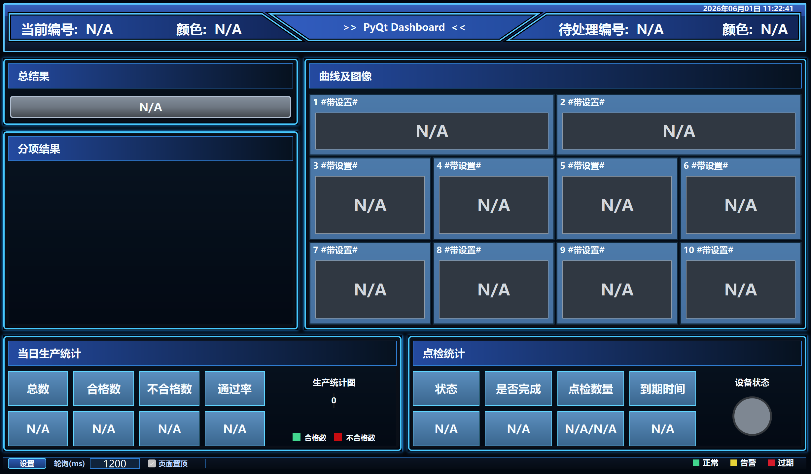

# PyQt Dashboard Template

基于 PyQt5 的桌面仪表盘界面示例。项目入口是 `main.py`，支持状态展示、数据绑定、曲线绘制、图片预览、全屏显示和本地配置保存。



## 功能概览

- PyQt5 桌面大屏界面
- 分项 OK/NG 状态展示
- 本地数据文件字段绑定与轮询刷新
- 表格数据解析与曲线绘制
- 图片路径绑定与预览
- 本地配置保存为 JSON 文件
- 支持通过 `--export` 导出界面预览图

## 环境要求

- Python 3.9+
- PyQt5 5.15+

## 安装依赖

```powershell
python -m pip install -r requirements.txt
```

## 运行

```powershell
python .\main.py
```

## 下载打包程序

Windows 可执行文件见 [`release/pyqt-dashboard-template.exe`](release/pyqt-dashboard-template.exe)。

## 导出预览图

```powershell
python .\main.py --export preview.png
```

## 配置文件

程序会读取和保存本地 JSON 配置文件。该文件可能包含本机数据目录、字段绑定和界面配置，通常不建议提交到公开仓库。

## 开源前注意

发布前请确认默认标题、示例文案、截图和配置内容可以公开。

## License

本项目使用 MIT License，详见 `LICENSE`。
